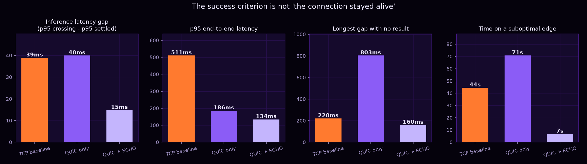
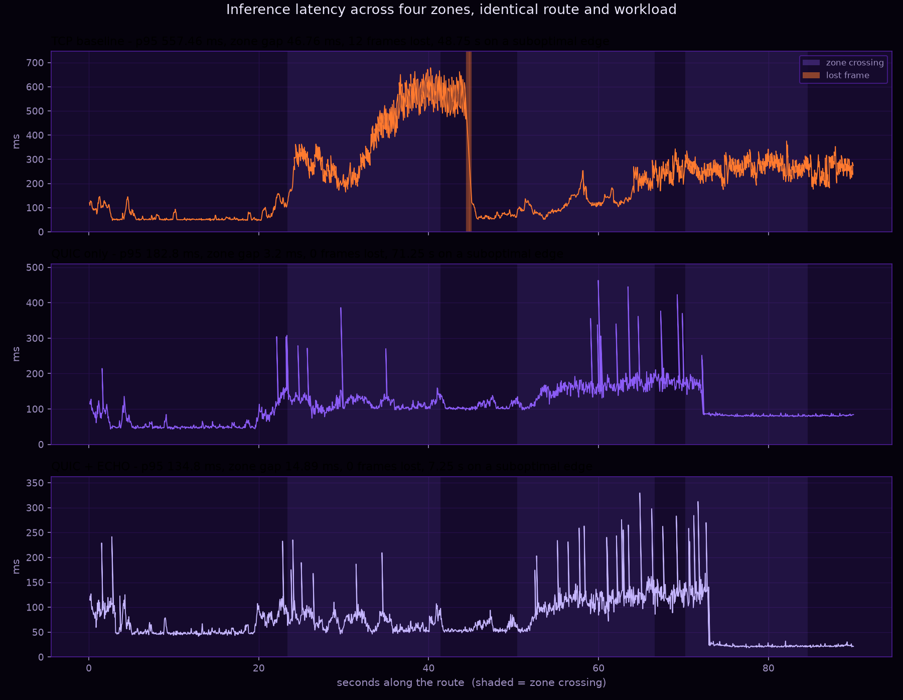
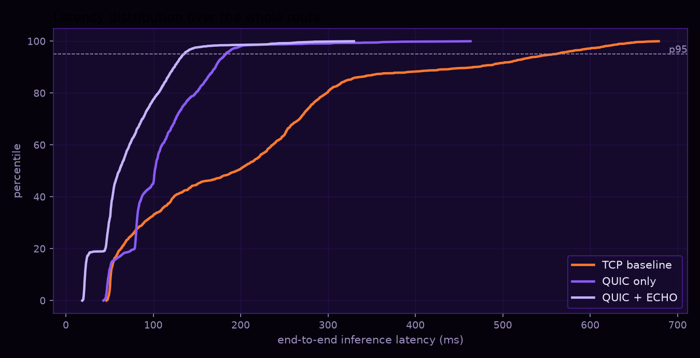

# ECHO — Edge Compute Handoff Orchestration

**Advanced Technology Pioneers 2026 · EDGE challenge prototype**

Keeping a live AI inference session running — and *fast* — while both the
network underneath it and the nearest compute location change.

---

## The problem, stated precisely

A device moving through the real world is surrounded by several networks at
once: Wi-Fi, private 5G, satellite, a wired dock. Today it uses one of them,
waits for it to break, and only then looks for another. By that point the call
has frozen, the frame is late, the page has stalled.

Fixing the transport is not enough. QUIC can carry a connection across a
network change without dropping it — that part is solved. But if the compute
you are talking to is still the box you started with, you are now reaching a
distant server over a worse path, and the connection being *alive* is cold
comfort. The latency the user feels is:

```
end-to-end = network round trip + queueing + inference time + response transit
```

Every term moves when you move. **ECHO watches all four networks and all four
edge sites continuously, predicts which pair is about to be best, and migrates
the live inference session there before the current path degrades** — with the
old edge still serving until the new one has proved it works.

The success criterion is not "the connection stayed alive". It is: **inference
results keep arriving, with a small latency spike, while both the network and
the compute location change underneath you.**

---

## What is in this repository

| Piece | Where | What it does |
|---|---|---|
| Access-network model | `echo_sim/world.py` | Four networks whose quality ramps along a route; the portable stand-in for `tc`/`netem` |
| Impairment relays | `echo_sim/netem.py` | Real packets, emulated delay / jitter / loss / bandwidth, applied per network |
| ECHO protocol | `echo_sim/protocol.py` | Message set and the session state that travels during a handoff |
| Edge inference service ×4 | `echo_sim/edge.py` | Speaks ECHO over QUIC *and* TCP; simulated inference that responds to load and cold starts |
| QUIC transport | `echo_sim/transport/quic.py` | Real `aioquic`, real connection migration, standby connections |
| TCP transport | `echo_sim/transport/tcp.py` | The cold-reconnect baseline |
| Agents | `echo_sim/agents/` | Watcher, Predictor, Intent, Decision, Handoff, Recovery, Troubleshooter, Explainer |
| Client + controller | `echo_sim/client.py` | Frame loop, agent loop, and the one branch that differs between the three modes |
| Measurement | `echo_sim/metrics.py` | Per-frame records, percentiles, the inference-latency gap |
| 3D dashboard | `dashboard/` | Third-person view of a person carrying a laptop through the four zones, live |

---

## Quick start

```bash
python3 -m venv .venv && .venv/bin/pip install -r requirements.txt
```

Run all three experiments and produce the figures:

```bash
.venv/bin/python scripts/run_experiments.py --duration 90 --seed 7
.venv/bin/python scripts/plot_results.py
```

Watch it live in 3D:

```bash
.venv/bin/python dashboard/server.py
```

then open <http://127.0.0.1:8080>, pick a mode and press **Run**. Everything
runs on one machine; nothing is installed outside the project folder.

Tests:

```bash
.venv/bin/python -m pytest -q
```

---

## The three experiments

All three use the same route, the same four network profiles, the same seed,
the same frame workload and the same edge servers. The only difference is the
client's decision logic, which is one branch in `client.py`.

**1. TCP baseline.** No migration and no prediction. A TCP connection is bound
to its four-tuple, so when the access network goes the connection goes with it.
The client notices via timeout, dials again, and the new edge has to rebuild
the inference session from nothing — a reconnect *and* a cold start.

**2. QUIC only.** The connection survives the network change: same connection
ID, new four-tuple, server-side path validation, no handshake. But the compute
never moves. This is the interesting baseline, because nothing looks broken —
no drops, no reconnects — and the latency is still worse the whole way, because
the user is talking to a box that is no longer near them.

**3. QUIC + ECHO.** Watch, predict, prepare, transfer, verify, commit, drain.

---

## The ECHO handoff

```
PREPARE   →  target allocates resources (the model is already resident there)
STATE     →  the live session state crosses — session only, never the model
READY     →  target confirms it reconstructed the session
VERIFY    →  target infers one duplicate frame, proving it actually works
COMMIT    →  target becomes the active inference server
ACK       →  handoff complete
DRAIN     →  old edge finishes outstanding work and accepts no more
```

Two properties make this safe rather than merely fast:

* **It starts early.** The sequence runs while the current path is still good,
  triggered by the Predictor's trend, not by a failure.
* **Nothing is discarded until the target acknowledges.** A failed handoff
  costs one wasted attempt; the session never left the old edge. `RECOVER`
  handles the case where the old path is gone too.

What actually travels is small — a few hundred bytes: session id, model id and
version, last processed frame, state version, and the object-tracking state.
The model itself is already on every edge. That is why a handoff costs
milliseconds instead of a model download.

---

## The agents

| Agent | Question it answers |
|---|---|
| **Watcher** | What does *every* network and *every* edge look like right now — including the ones nobody is using? |
| **Predictor** | Where is each one heading? (EWMA level + least-squares slope, extrapolated over a horizon) |
| **Intent** | What is the user doing? A call wants steadiness, a download wants throughput, inference wants lowest total time. |
| **Decision** | Which *(network, edge)* pair has the lowest predicted end-to-end cost — with hysteresis, so it does not oscillate? |
| **Handoff** | Run the sequence above, early and reversibly. |
| **Recovery** | The handoff failed. Stay, retry elsewhere, or cold-start — and back off the edge that failed. |
| **Troubleshooter** | Things feel bad and nothing is switching. *Why?* Congestion, coverage, instability, loss, edge load, or simply compute-bound. |
| **Explainer** | Say it in a sentence a person would accept, generated from the same numbers the decision used. |

Scoring is over the *pair*, not the network alone:

```
score = w₁·predicted_path_rtt + w₂·predicted_jitter + w₃·predicted_loss
      + w₄·predicted_inference_ms + w₅·edge_load + w₆·proximity_cost
```

with the weight vector supplied by the Intent Agent. This is why satellite
loses even where it has the best coverage: it is *available*, and still the
wrong answer, because 500+ ms of round trip is physics, not congestion.

Planned but not built: Cost, Security, Energy, Policy and Learning agents. The
weight vector in `config.py` is the seam they plug into.

---

## Preload buffer

For live traffic — a call, live inference — buffering cannot help; you cannot
pre-send something that has not happened yet, so the switch itself has to be
seamless. For non-live traffic — a lecture stream, music — a few seconds can be
pre-fetched while the link is good, and that buffer covers the entire handoff.
The Intent Agent decides which case applies and the dashboard shows which.

---

## What is real and what is emulated

Stated plainly, because it is the first thing a judge should ask.

**Real:** the QUIC stack (`aioquic`), the TLS handshake, connection migration
across a genuinely different four-tuple, all four edge servers as independent
services, the ECHO message exchange, real UDP and TCP sockets, and every
latency number — measured end to end from the client, not modelled.

**Emulated:** the link conditions. Delay, jitter, loss and bandwidth are
applied by relays in `netem.py` that sit between client and edge, driven by the
coverage model in `world.py`. This is what `tc`/`netem` does, moved into
userspace so the whole thing runs on one laptop of any OS. The relay identifies
which network a packet is on by the client's source port, which is also what
makes migration observable.

**Simulated:** the inference itself is a controlled delay that responds to edge
load and to whether the session was warm-started or rebuilt cold. What this
project measures is end-to-end inference latency and session continuity across
a handoff, not the accuracy of a detector. Swapping in a real YOLO forward pass
means replacing `EdgeService._infer` and nothing else.

**On Linux**, `world.py`'s numbers can be pushed into real `tc` qdiscs across
network namespaces instead of into the relays; the rest of the system does not
change. The relay layer exists so the prototype is not tied to one OS.

---

## Metrics

The headline:

```
Inference Latency Gap = p95 latency while crossing zones − p95 latency while settled
```

The crossing windows are fixed positions on the route, identical for every
mode, so a mode cannot improve its score by declaring fewer transitions.

Also recorded: mean / median / p95 / p99 / max latency, frames lost and
duplicated, longest gap with no result at all (the visible freeze), handoff
duration broken down by phase, state bytes transferred, failed handoffs,
reconnects, and **time spent on an edge that was no longer the best available**
— the number that separates QUIC-only from ECHO.

---

## Results

90 seconds, 1799 frames at 20 fps, seed 7, identical route and workload for all
three. Full data in `results/`, figures regenerated by `scripts/plot_results.py`.

| | TCP baseline | QUIC only | **QUIC + ECHO** |
|---|---|---|---|
| p95 end-to-end latency | 557 ms | 183 ms | **135 ms** |
| median latency | 195 ms | 102 ms | **61 ms** |
| frames lost | 12 | 0 | **0** |
| longest gap with no result | 332 ms | 170 ms | **150 ms** |
| time on a suboptimal edge | 49 s | 71 s | **7 s** |
| reconnects | 1 | 0 | **0** |
| successful handoffs | — | — | **4** |
| inference latency gap | 47 ms | 3 ms | 15 ms |



**Reading this honestly.** QUIC-only wins the inference-latency-gap column, and
that is not a mistake — it is the point. QUIC-only never spikes because it is
*uniformly* worse: it holds a connection to an edge it should have left, so its
settled latency is already high and a zone crossing barely moves it. Measured
against itself, it looks stable. Measured against what the user should have
been getting, it spends 71 of 90 seconds on the wrong edge.

The gap metric is only meaningful next to the absolute numbers. ECHO has the
lowest p95, the lowest median, the shortest freeze, no losses, no reconnects,
and 7 seconds on a suboptimal edge instead of 71 — while performing four live
session migrations. Its 15 ms gap is the visible cost of those four handoffs,
paid to avoid a permanently elevated floor.

TCP shows the failure mode both others avoid: one connection loss, a cold
session rebuild, twelve frames gone, and the largest spike at a crossing.





---

## Dashboard

A third-person 3D view in the EDGE palette - orange, white and gray on black.
You watch a person carrying a laptop walk the route while the four edge sites
stand along it. The active link is drawn from the laptop to the serving edge
with packets flowing along it; during a handoff a second white beam reaches
ahead to the edge being prepared.

Around the scene, three things are readable at a glance:

* **All four access networks**, each with its six tracked characteristics -
  signal, latency, jitter, packet loss, bandwidth and availability - plus the
  Predictor's verdict on where that link is heading. Networks nobody is using
  are shown exactly as fully as the active one, because that is the point.
* **All four edge sites** across the top: expected inference cost, CPU, and
  active sessions, with the serving edge lit and the edge being prepared
  outlined.
* **The agent pipeline**, all eight at once, each showing what it currently
  believes: how many links the Watcher is holding samples for, which link the
  Predictor thinks fails next and when, what the Intent Agent thinks you are
  doing, the Decision Engine's chosen pair with its score and its runner-up and
  how close a challenger is to earning a switch, the Handoff state machine, the
  Recovery Agent's backoff list, the Troubleshooter's root cause, and the
  Explainer's sentence.

Every value is read straight off the agent that produced it, so the dashboard
cannot show a decision that differs from the one actually taken.

The browser is fed the same event stream that the log file records, so what is
on screen and what the numbers say cannot disagree. Finished runs can be
replayed from their JSONL recording.

---

## Layout

```
echo_sim/          the system
  world.py         where the user is and what each network looks like there
  netem.py         impairment relays (the tc/netem stand-in)
  protocol.py      ECHO messages + session state
  edge.py          edge inference service, QUIC and TCP
  client.py        robot client, frame loop, agent loop
  runner.py        boots a whole experiment and tears it down
  metrics.py       percentiles and the inference-latency gap
  telemetry.py     one event stream, to the dashboard and to disk
  transport/       quic.py (migration, standby), tcp.py (cold reconnect)
  agents/          watcher, predictor, intent, decision, handoff,
                   recovery, troubleshooter, explainer
dashboard/         server.py + index.html (Three.js, third-person view)
scripts/           run_experiments.py, plot_results.py
tests/             the parts where a silent mistake would invalidate results
results/           figures and recorded runs
```
